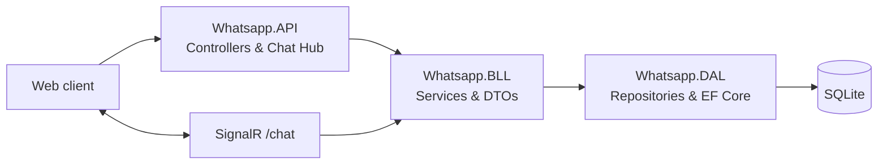
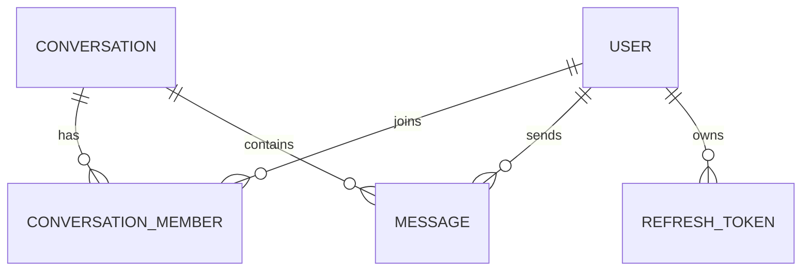

# WhatsApp Clone API

A layered ASP.NET Core backend for a chat application. It provides account management, direct and group conversations, persisted message history, and live chat events over SignalR.

## Overview

The API supplies the server-side capabilities needed by a messaging client: users can register and sign in, discover other users, create conversations, retrieve their conversation list and message history, and exchange messages in real time. Conversation membership is checked before messages are read or sent.

## Features

- Registration and sign-in with ASP.NET Core Identity
- JWT access tokens and persisted, hashed refresh tokens
- Authenticated user directory
- One-to-one conversations, with duplicate direct conversations reused
- Group conversation creation
- Conversation summaries with the latest message
- Persistent message history with cursor-based pagination
- Real-time message delivery, typing events, and online-user notifications through SignalR

## Architecture

The solution separates HTTP and SignalR delivery, application logic, and data access into three projects:



- **API layer** — exposes controller endpoints, configures authentication, CORS, Swagger, validation, and the `ChatHUb` SignalR hub.
- **Business layer** — coordinates account-token, conversation, and message operations through services and DTOs.
- **Data access layer** — contains EF Core entities, `ApplicationDbContext`, repositories, and migrations.

## Technologies

| Technology | Purpose |
| --- | --- |
| .NET 10 / ASP.NET Core | Web API and application host |
| ASP.NET Core Identity | User and role persistence, password handling |
| JWT Bearer authentication | API and SignalR access-token validation |
| Entity Framework Core 10 | ORM, migrations, and database access |
| SQLite | Local relational database |
| SignalR | Live chat, typing, and presence notifications |
| FluentValidation | Registration and login request validation |
| Swagger / OpenAPI | Interactive API documentation |

## Project Structure

```text
Whatsapp.API/       HTTP controllers, SignalR hub, startup, validation, configuration
Whatsapp.BLL/       Application services and request/response DTOs
Whatsapp.DAL/       EF Core context, entities, repositories, helpers, migrations
Whatsapp.src.sln    Solution entry point
```

## Database

SQLite is accessed through EF Core's `ApplicationDbContext`, which extends `IdentityDbContext<User>`. Migrations are stored in `Whatsapp.DAL/Migrations`.

Core application entities are `User`, `Conversation`, `ConversationMember`, `Message`, and `RefreshToken`. `ConversationMember` is the join entity between users and conversations and uses a composite key of conversation and user IDs. A conversation can contain many messages; each message belongs to one conversation and references its sender.



## Authentication & Authorization

Account registration and login return an access token and refresh token. Refresh tokens are stored as SHA-256 hashes; the account service includes refresh-token rotation and revocation operations, and logout revokes all refresh tokens for the authenticated user.

Bearer JWT authentication validates issuer, audience, signing key, and token lifetime. The conversation, message-history, and user-directory controllers require authorization. The chat hub obtains the JWT from the SignalR `access_token` query-string value at `/chat`; hub operations use the authenticated user ID and enforce conversation membership when sending messages.

## Real-Time Communication

`ChatHUb` is mapped to `/chat`. On connection, the hub tracks the user in memory, joins the connection to each of that user's conversation groups, and broadcasts the current online-user list through `Notify`.

Clients can invoke:

- `SendMessageAsync` — persists a message and broadcasts `ReceiveMessage` to the conversation group.
- `NotifyTyping` — notifies other members through `NotifyTyping`.
- `StopedTyping` — notifies other members through `UserStoppedTyping`.

## Pagination

`GET /api/Message/{conversationId}/messages` uses cursor pagination for message history. Results are ordered newest first by sent time, then message ID. Supply optional `cursor` and `limit` query parameters; the response includes `nextCursor` and `hasNext` when another page is available. The default page size is 20.

Example:

```http
GET /api/Message/CONVERSATION_ID/messages?limit=20&cursor=2026-08-25T10:30:00Z
Authorization: Bearer ACCESS_TOKEN
```

## API

The user, conversation, and message endpoints require a bearer access token. Logout also requires an authenticated caller; registration, login, and token refresh receive their credentials in the request body.

| Method | Endpoint | Description |
| --- | --- | --- |
| POST | `/api/Account/register` | Register a user and return access and refresh tokens. |
| POST | `/api/Account/login` | Sign in and return access and refresh tokens. |
| POST | `/api/Account/refresh-token` | Exchange a refresh token for a new token pair. |
| POST | `/api/Account/logout` | Revoke the current user's refresh tokens. |
| GET | `/api/Users` | List users other than the authenticated user. |
| POST | `/api/Conversation` | Create or retrieve a direct conversation. |
| POST | `/api/Conversation/CreateGroup` | Create a group conversation. |
| GET | `/api/Conversation` | Get the authenticated user's conversations. |
| GET | `/api/Message/{conversationId}/messages` | Get paginated history for a conversation. |

## Getting Started

### Prerequisites

- [.NET 10 SDK](https://dotnet.microsoft.com/download)
- The EF Core CLI tool, if you need to apply migrations:

  ```bash
  dotnet tool install --global dotnet-ef
  ```

### Clone

```bash
git clone <repository-url>
cd <project-folder>
```

### Configuration

The API reads its SQLite connection string from `ConnectionStrings:DefaultConnection` and JWT settings from the `JWT` section. Set local, non-production values in `Whatsapp.API/appsettings.Development.json`, user secrets, or environment variables. Do not commit secrets.

```json
{
  "ConnectionStrings": {
    "DefaultConnection": "Data Source=/absolute/path/to/Whatsapp.DAL/chat.db"
  },
  "JWT": {
    "Issuer": "YOUR_ISSUER",
    "Audience": "YOUR_AUDIENCE",
    "SecretKey": "YOUR_LONG_RANDOM_SECRET",
    "AccessTokenDurationInHour": 8,
    "RefreshTokenDurationInDays": 7
  }
}
```

The design-time context factory in `Whatsapp.DAL/data/ApplicationDbContextFactory.cs` also contains the SQLite path used by EF Core tooling. Ensure it points to a valid local database location before running migrations.

The included CORS policy allows `http://localhost:5173`; update it in `Program.cs` if your client runs on another origin.

### Database Setup

Restore dependencies and apply the existing migrations:

```bash
dotnet restore
dotnet ef database update --project Whatsapp.DAL --startup-project Whatsapp.API
```

### Run the Application

```bash
dotnet run --project Whatsapp.API
```

The default development profiles expose the API at `http://localhost:5295` and, when using the HTTPS profile, `https://localhost:7124`.

## API Documentation

Swagger UI is enabled in the application pipeline. With the default HTTP profile running, open:

```text
http://localhost:5295/swagger
```

## Contributing

Contributions are welcome. Please keep changes scoped, follow the existing layered structure, and include migrations for intentional database schema changes.
